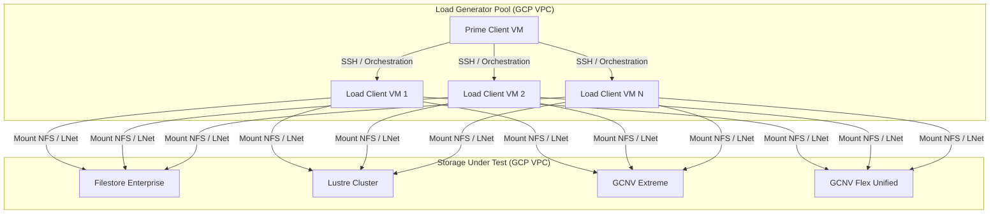

# GCP File System Benchmarking & SPECstorage Solution 2020 Guide

This repository contains benchmarking utilities and a comprehensive guide for planning, provisioning, configuring, and executing the **SPECstorage Solution 2020** benchmark on Google Cloud Platform (GCP).

It covers local SSD setup, automated load client cluster deployment using Google Cloud Compute Engine **Managed Instance Groups (MIG)**, client-side performance tuning, and parallel cluster administration using **`pdsh` (Parallel Distributed Shell)**.

---

## 1. Local Storage Discovery & Setup

Before benchmarking, you must discover and format your local NVMe storage on your testing instances.

### 1.1 Device and Volume Discovery
Write the discovery loop to a file called `disk-info.sh`, make it executable, and run it:
```bash
cat << 'EOF' > disk-info.sh
for d in /sys/block/nvme*n1; do
  dev="/dev/$(basename $d)"
  serial=$(udevadm info --query=property --name=$dev | grep ID_SERIAL= | cut -d= -f2)
  echo "$dev -> $serial"
done
EOF
chmod +x disk-info.sh

# Example output
$ ./disk-info.sh
/dev/nvme0n1 -> Google_EphemeralDisk_local-nvme-ssd-0
/dev/nvme1n1 -> Google_PersistentDisk_instance-20260609-181417
```

### 1.2 Formatting and Mounting Local SSD with XFS
Once the Local SSD device (e.g., `/dev/nvme0n1`) has been identified, perform the following steps to format and mount it using XFS:

1. **Format the Device:**
   Use `mkfs.xfs` to format the ephemeral disk. Specify the `-f` flag to force the formatting if a file system already exists:
   ```bash
   sudo mkfs.xfs -f /dev/nvme0n1
   ```

2. **Create a Mount Directory:**
   Create a target mount directory:
   ```bash
   sudo mkdir -p /mnt/disks/local-ssd
   ```

3. **Mount the Disk:**
   Mount the disk using the recommended `discard` option for TRIM support on NVMe SSD devices:
   ```bash
   sudo mount -o discard,defaults,nofail /dev/nvme0n1 /mnt/disks/local-ssd
   ```

4. **Configure Permissions:**
   Set write permissions so that non-root test users can run benchmarks in the directory (using the sticky bit `1777` for multi-user security):
   ```bash
   sudo chmod 1777 /mnt/disks/local-ssd
   ```

5. **Persistent Mount via `/etc/fstab` (Optional):**
   To ensure the drive mounts automatically if the VM restarts, get the UUID:
   ```bash
   sudo blkid /dev/nvme0n1
   ```
   Append the following line to `/etc/fstab` (replace `<UUID>` with the actual UUID string):
   ```text
   UUID=<UUID> /mnt/disks/local-ssd xfs discard,defaults,nofail 0 2
   ```

   > [!IMPORTANT]
   > Always use the `nofail` option for local SSDs in `/etc/fstab`. Since local SSDs are ephemeral and are discarded when the VM stops, the VM will fail to boot if the drive is missing and `nofail` is omitted.

---

## 2. SPECstorage Benchmark Architecture

SPECstorage Solution 2020 relies on a decentralized, master-client load generation architecture:
*   **Prime Client (Controller):** Orchestrates the benchmark execution, coordinates synchronization, collects metrics, and aggregates the final results.
*   **Load Clients:** VM instances that connect to the Prime Client, mount the storage system under test (SUT), and run the workload generator daemon (`netmist`) to generate synthetic I/O loads.
*   **Storage Under Test (SUT):** The storage system being tested (e.g., Filestore, Lustre, GCNV).

### Architecture Diagram




## 3. Infrastructure Provisioning & GCP Quotas

To achieve accurate performance benchmarks, VM instances and storage resources must be properly provisioned and sized.

### 3.1 GCP Quota Verification (Pre-requisite)
Before provisioning high-performance storage in GCP, check and request quota increases if necessary:
1. **Filestore Capacity (TiB):** The default quota for regional/enterprise storage capacity in a project is often limited (e.g., 0 or 10 TiB). Since the minimum capacity for an Enterprise tier instance is 1 TiB or 10 TiB depending on the region, you may need to request an increase.
   * *Metric Name:* `filestore.googleapis.com/enterprise_regional_gb` (for Enterprise) or `filestore.googleapis.com/high_scale_ssd_gb` (for High Scale).
2. **Filestore Instance Count:** The limit on the number of instances per region.
   * *Metric Name:* `filestore.googleapis.com/instances`
3. **Compute Engine vCPUs:** Ensure you have enough vCPU quota to launch clusters of `c3-highcpu-22` or `c2-standard-16` VMs.
   * *Metric Name:* `compute.googleapis.com/c3_cores` (for C3 cores) or `compute.googleapis.com/cpus` (for total CPUs).

To request quota increases:
* Go to the **IAM & Admin > Quotas** page in the GCP Console.
* Filter by the metric name above, select your region, and click **Edit Quotas** to submit a request.

---

### 3.2 Google Cloud Filestore (Enterprise/High Scale)
Filestore Enterprise is managed NFSv3/v4.1. It scales performance linearly with capacity up to 6.4 GB/s read throughput and 250,000 IOPS.

#### Option A: Create via `gcloud` CLI
Run the following command on your local machine to provision the Filestore Enterprise instance:
```bash
gcloud filestore instances create spec-filestore-ent \
    --project=PROJECT_ID \
    --location=us-central1-a \
    --tier=ENTERPRISE \
    --file-share=name=spec_share,capacity=10240 \
    --network=name=VPC_NAME
```
*Replace `PROJECT_ID` with your target project ID and `VPC_NAME` with your VPC network name (e.g., `default`).*

#### Option B: Create via GCP Console (Web UI)
1. In the Google Cloud Console, go to **Filestore** > **Instances**.
2. Click **Create Instance**.
3. Set the following fields:
   * **Instance ID:** `spec-filestore-ent`
   * **Instance Tier:** `Enterprise` (zonal or regional)
   * **Location:** Choose the region and zone where your load VMs reside (e.g., `us-central1` / `us-central1-a`).
   * **VPC Network:** Select your VPC network.
   * **Capacity:** Specify `10 TiB` (minimum size).
   * **File Share Name:** `spec_share`
4. Click **Create**.

#### Option C: Create via Terraform
```hcl
resource "google_filestore_instance" "filestore_enterprise" {
  name     = "spec-filestore-ent"
  location = "us-central1-a"
  tier     = "ENTERPRISE"

  file_shares {
    capacity_gb = 10000 # 10 TiB
    name        = "spec_share"
  }

  networks {
    network = "projects/my-gcp-project/global/networks/my-vpc"
    modes   = ["MODE_IPV4"]
  }
}
```

---

### 3.3 Google Cloud NetApp Volumes (GCNV) Extreme
GCNV Extreme provides fully managed NetApp ONTAP volumes delivering up to 4.5 GB/s throughput.

#### Terraform Definition
```hcl
resource "google_netapp_storage_pool" "extreme_pool" {
  name          = "gcnv-extreme-pool"
  location      = "us-central1"
  service_level = "EXTREME"
  capacity_gib  = 20480 # 20 TiB
  network       = "projects/my-gcp-project/global/networks/my-vpc"
}

resource "google_netapp_volume" "extreme_volume" {
  name           = "gcnv-extreme-vol"
  location       = "us-central1"
  storage_pool   = google_netapp_storage_pool.extreme_pool.name
  share_name     = "gcnv_extreme"
  capacity_gib   = 10240 # 10 TiB
  protocols      = ["NFSV3"] # SPECstorage benchmarks run best on NFSv3
  export_policy {
    rules {
      allowed_clients = "0.0.0.0/0"
      access_type     = "READ_WRITE"
      has_root_access = "true"
      nfsv3           = true
      nfsv4           = false
    }
  }
}
```

---

### 3.4 GCNV Flex Unified (Default-Mode vs ONTAP-Mode)
Flex Unified is a high-performance service level that decouples performance (IOPS and throughput) from capacity. 

#### Terraform Definition (Flex Storage Pool & Volume)
```hcl
resource "google_netapp_storage_pool" "flex_pool" {
  name          = "gcnv-flex-pool"
  location      = "us-central1"
  service_level = "FLEX"
  capacity_gib  = 4096 # 4 TiB
  network       = "projects/my-gcp-project/global/networks/my-vpc"
}

resource "google_netapp_volume" "flex_volume" {
  name           = "gcnv-flex-vol"
  location       = "us-central1"
  storage_pool   = google_netapp_storage_pool.flex_pool.name
  share_name     = "gcnv_flex"
  capacity_gib   = 2048 # 2 TiB
  protocols      = ["NFSV41"] # NFSv4.1 supported with flex pools
  export_policy {
    rules {
      allowed_clients = "0.0.0.0/0"
      access_type     = "READ_WRITE"
      has_root_access = "true"
      nfsv3           = false
      nfsv4           = true
    }
  }
}
```

---

### 3.5 Lustre Parallel File System (via GCP HPC Toolkit)
For maximum throughput under highly parallel workflows, Lustre is deployed using the Google Cloud HPC Toolkit.

#### HPC Toolkit Blueprint Configuration (`lustre.yaml`)
```yaml
blueprint_name: hpc-lustre-storage

vars:
  project_id: my-gcp-project
  deployment_name: spec-lustre
  region: us-central1
  zone: us-central1-a

deployment_groups:
  - group: cluster-network
    modules:
      - source: modules/network/vpc
        kind: terraform
        use: [network]

  - group: storage
    modules:
      - source: community/modules/storage/lustre-fs
        kind: terraform
        use: [network]
        settings:
          fs_name: spec-lustre
          mds_machine_type: c2-standard-8
          oss_machine_type: c2-standard-16
          oss_node_count: 4
          oss_disk_size_gb: 1500
          oss_disk_type: pd-ssd # High performance SSD backed storage
```

---

## 4. Automated Load Client Cluster Deployment

To scale your benchmark to multiple load generator VMs, use a Compute Engine **Managed Instance Group (MIG)** with a startup config script. This guarantees that all client VMs are created, configured, and mounted automatically.

### 4.1 Deployment Timeline & Pre-requisites
You must provision the **Prime Client** VM first before creating the MIG. The Prime Client acts as the central controller and generates the SSH key pair that the MIG load clients must trust.

Follow this execution order:
1.  **Launch the Prime Client VM:** Create a single standalone VM (e.g., `n2-standard-8`) in your VPC.
2.  **Mount Storage on the Prime Client:** Mount your shared Filestore volume to `/mnt/filestore`.
3.  **Install & Compile SPEC:** Install SPECstorage to `/mnt/filestore/SPEC` and compile `netmist` natively on the Prime Client (documented in Section 7).
4.  **Generate SSH Keys on Prime Client:** Run `ssh-keygen` to create the key pair.
5.  **Create the Instance Template:** Run the `gcloud compute instance-templates create` command (Section 4.4) which reads the Prime Client's public key from step 4 and injects it into the template's metadata.
6.  **Create the Managed Instance Group:** Launch the cluster (Section 4.5) using the template.

---

### 4.2 Create the Startup Script (`client-startup.sh`)
Save this file as `client-startup.sh` on your local environment (or Prime Client):

```bash
#!/bin/bash
# 1. Install NFS utilities
dnf install -y nfs-utils

# 2. Set file descriptor limits permanently
cat << 'EOF' >> /etc/security/limits.conf
*               soft    nofile          1048576
*               hard    nofile          1048576
*               soft    nproc           524288
*               hard    nproc           524288
EOF

# 3. Apply sysctl TCP tuning parameters
cat << 'EOF' >> /etc/sysctl.conf
net.core.rmem_max = 134217728
net.core.wmem_max = 134217728
net.ipv4.tcp_rmem = 4096 87380 67108864
net.ipv4.tcp_wmem = 4096 65536 67108864
net.core.netdev_max_backlog = 250000
net.core.somaxconn = 65535
EOF
sysctl -p

# 4. Create mount point and mount Filestore Enterprise (NFSv3)
mkdir -p /mnt/filestore
mount -t nfs -o vers=3,proto=tcp,rsize=524288,wsize=524288,hard,timeo=600,retrans=3,nconnect=2 <FILESTORE_IP>:/spec_share /mnt/filestore

# 5. Create test directory with write permissions
mkdir -p /mnt/filestore/test
chmod 1777 /mnt/filestore/test
```
*(Replace `<FILESTORE_IP>` with your actual Filestore instance IP).*

### 4.3 Generate SSH Keys on the Prime Client
Ensure you have an SSH key pair generated on the Prime Client VM:
```bash
ssh-keygen -t rsa -N "" -f ~/.ssh/id_rsa
```

### 4.4 Create the Compute Engine Instance Template
This template configures VM size, network, OS image, and injects the Prime Client's public key metadata to establish passwordless SSH across all created nodes:

```bash
gcloud compute instance-templates create spec-client-template \
    --project=PROJECT_ID \
    --machine-type=c3-highcpu-22 \
    --image-family=rocky-linux-9 \
    --image-project=rocky-linux-cloud \
    --network=default \
    --subnet=default \
    --scopes=cloud-platform \
    --metadata=ssh-keys="YOUR_USERNAME:$(cat ~/.ssh/id_rsa.pub)" \
    --metadata-from-file=startup-script=client-startup.sh
```
*   *Replace `PROJECT_ID` with your GCP project ID.*
*   *Replace `YOUR_USERNAME` with your GCP/Linux VM username (e.g., `admin_mduffield_altostrat_com`).*

### 4.5 Create the Managed Instance Group (MIG)
Launch a cluster of **4 instances**:
```bash
gcloud compute instance-groups managed create spec-client-group \
    --project=PROJECT_ID \
    --base-instance-name=spec-client \
    --size=4 \
    --template=spec-client-template \
    --zone=us-central1-a
```

### 4.6 Scaling the Cluster
If you need to resize the cluster to **8 instances** (or scale down to **0** to save costs):
```bash
gcloud compute instance-groups managed resize spec-client-group \
    --size=8 \
    --zone=us-central1-a
```

---

## 5. Prime Client Administration (`pdsh` & SSH Configuration)

To monitor and run verification checks across your cluster in parallel, configure **`pdsh` (Parallel Distributed Shell)** and SSH settings on the Prime Client VM.

### 5.1 Install `pdsh` on the Prime Client
Install `pdsh` using the EPEL repository (on RHEL/Rocky Linux):
```bash
sudo dnf install -y epel-release
sudo dnf install -y pdsh
```

Configure `pdsh` to use SSH as its default remote connection method:
```bash
echo "export PDSH_RCMD_TYPE=ssh" >> ~/.bashrc
source ~/.bashrc
```

### 5.2 Bypass SSH Host Verification Prompts
Create or update `~/.ssh/config` on the Prime Client VM so the parallel commands (and `sfs_manager`) can run without prompting for host confirmation:
```text
Host 10.128.*
    StrictHostKeyChecking no
    UserKnownHostsFile /dev/null
```
*(Adjust `10.128.*` to match your internal VPC IP range).*

### 5.3 Verify Cluster Health using `pdsh`
You can run shell commands on all client VMs in parallel. To check filesystem usage across all IPs in your cluster:

```bash
# Query the MIG VM IPs and execute df -h in parallel
CLIENT_IPS=$(gcloud compute instances list --filter="name ~ 'spec-client-'" --format="value(networkInterfaces[0].networkIP)" | paste -sd, -)
pdsh -w "$CLIENT_IPS" "df -h /mnt/filestore"
```

---

## 6. Storage Mount Options & Optimizations

Storage mount configurations on the Load Clients drastically impact performance results. Below are the recommended mount options for SPECstorage testing on GCP.

### 6.1 Mount Commands

#### Filestore (NFSv3)
*   **Filestore Basic Tier:**
    ```bash
    sudo mount -t nfs -o vers=3,proto=tcp,rsize=1048576,wsize=1048576,hard,timeo=600,retrans=3 <FILESTORE_IP>:/spec_share /mnt/filestore
    ```
*   **Filestore Enterprise Tier:**
    ```bash
    sudo mount -t nfs -o vers=3,proto=tcp,rsize=524288,wsize=524288,hard,timeo=600,retrans=3,nconnect=2 <FILESTORE_IP>:/spec_share /mnt/filestore
    ```
*   **Filestore High Scale SSD Tier:**
    ```bash
    sudo mount -t nfs -o vers=3,proto=tcp,rsize=524288,wsize=524288,hard,timeo=600,retrans=3,nconnect=7 <FILESTORE_IP>:/spec_share /mnt/filestore
    ```

#### Custom Mount Option (e.g. custom NFS setup)
If using a custom configuration, you can mount manually:
```bash
## smaller transfer size
sudo mount -t nfs -o vers=3,proto=tcp,rsize=65536,wsize=65536,hard,timeo=600,retrans=3,nconnect=4,rw <FILESTORE_IP>:/spec_share /mnt/filestore

## bigger transfer size
sudo mount -t nfs -o vers=3,proto=tcp,rsize=524288,wsize=524288,hard,timeo=600,retrans=3,nconnect=7,rw <FILESTORE_IP>:/spec_share /mnt/filestore
```
Or define it permanently in `/etc/fstab`:
```text
nfs:/data /data nfs rw,hard,rsize=65536,wsize=65536,vers=3,tcp,nconnect=4 0 0
```

#### GCNV Extreme (NFSv3)
```bash
sudo mount -t nfs -o vers=3,proto=tcp,rsize=262144,wsize=262144,hard,timeo=600,retrans=2,nconnect=16 <GCNV_IP>:/gcnv_extreme /mnt/gcnv_extreme
```

#### GCNV Flex Unified (NFSv4.1)
```bash
sudo mount -t nfs -o vers=4.1,hard,timeo=600,retrans=2,nconnect=16,rsize=262144,wsize=262144 <GCNV_IP>:/gcnv_flex /mnt/gcnv_flex
```

#### Lustre
Ensure `lustre-client` packages are installed on all Load Clients:
```bash
sudo modprobe lustre
sudo mount -t lustre <MDS_IP>@tcp:/spec-lustre /mnt/lustre
```


---

## 7. SPECstorage Installation & Compilation

Since the benchmark is executing across a cluster of VMs, the benchmark binaries must be identical and available at the exact same path.

0.  Download SPECstorage from [SPEC](https://www.spec.org/), or use existing ISO file, for example:
    ```bash
    gcloud storage cp gs://cross-project-001/SPECstorage/SPECstorage_2020.iso .
    ```
1.  Mount Filestore on the Prime Client VM.
2.  Mount the distributed ISO image:
    ```bash
    sudo mkdir /mnt/iso
    sudo mount -o loop SPECstorage_2020.iso /mnt/iso
    ```
3.  Mount test file systems (e.g, NFS, GPFS, etc.) - see mount commands above
4.  Install SPECstorage to the Filestore share:
    ```bash
    cd /mnt/iso/SPECstorage2020/
    python3 SM2020 --install-dir=/mnt/test-file-system/SPEC
    ```
5.  Set permissions and change directory to the location of the SPEC benchmark:
    ```bash
    chmod 755 /mnt/test-file-system/SPEC
    cd /mnt/test-file-system/SPEC
    ```
6. Create the test directory in the test file system, ***as hpcuser***:
    ```bash
    mkdir /mnt/test-file-system/test.d
    ```
7.  Create the hosts file in the same directory from where the tests will be run:
    ```bash
    cp ~/hostfile spec.hosts
    ```
    There should be a line for each of the clients and the test directory: 
    ```bash
    host1 /mnt/test-file-system/test.d
    host2 /mnt/test-file-system/test.d
    host3 /mnt/test-file-system/test.d
    ...
    ```
8.  Create/edit the `sfs_rc` file
    Edit where necessary:
    ```bash
    ##############################################################################
    #       sfs_rc
    ##############################################################################
    
    USER=hpcuser
    CLIENT_MOUNTPOINTS=spec.hosts
    EXEC_PATH=/mnt/test-file-system/SPEC/binaries/linux/x86_64/netmist
    NETMIST_LICENSE_KEY=<license key number>
    NETMIST_LICENSE_KEY_PATH=/tmp/netmist_license_key
    
    BENCHMARK=EDA_BLENDED
    LOAD=100
    INCR_LOAD=50
    NUM_RUNS=10
    ```
  

## 8. Running the SPECstorage benchmark

Running the benchmark:
```bash
python3 SM2020 -r sfs_rc -s test-label
```

If you re-run:
1.  Flush data and clear cache
    ```bash
    pdsh -w ^/home/hpcuser/hostfile "sudo sync && sudo sh -c 'echo 3 > /proc/sys/vm/drop_caches'"
    ```
2.  Create new test directory 
    ```bash
    mkdir /mnt/filestore-iad-001/test.d/test-002
    ```
3.  Update the client file with the updated test directory location
    ```bash
    host1 /mnt/filestore-iad-001/test.d/test-002
    host2 /mnt/filestore-iad-001/test.d/test-002
    host3 /mnt/filestore-iad-001/test.d/test-002
    ...
    ```
4. Start the new test 
   ```bash
   python3 SM2020 -r sfs_rc -s test-label-002
   ```
    


---

## 10. Analyzing and Interpreting Results

Once complete, SPECstorage outputs results inside the `results/` directory, generating detailed text reports and raw `.res` files.

### 10.1 Critical Metrics
1.  **Requested Op Rate:** The input IO load targeted at the filesystem.
2.  **Achieved Op Rate:** The actual IO rate sustained by the filesystem. If this drops below the Requested Op Rate, the storage system has saturated.
3.  **Average Response Time (Latency):** Measured in milliseconds. A healthy storage tier should keep average response times under **2 ms** for small file random operations (e.g., EDA/Software Build) and under **10 ms** for massive read streams.
4.  **Throughput (MB/s):** The raw throughput.

### 10.2 Graphing the Performance Curve
A key outcome of a SPECstorage test is the **Response Time vs. Throughput (Ops/sec)** curve.

```text
Latency (ms)
  ^
  |                                       /  <-- SUT Saturation Point
  |                                      /
  |                                    _/
  |                                ___/
  |                        _______/
  |_______________________/
  +---------------------------------------------> Throughput (Ops/Sec)
```

*   **Linear Phase:** Response time remains flat as throughput scales.
*   **Knee Point:** Latency begins to curve upwards. This indicates the optimal operating limit of the storage configuration.
*   **Saturation Point:** Latency spikes exponentially, and achieved operations fail to match requested operations.
