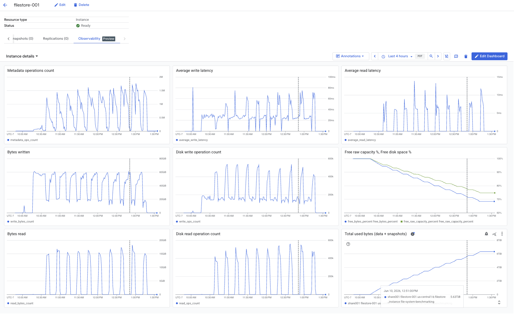

## Jun 10

### Filestore Instance Details: `filestore-001`

| Parameter               | Configuration Value                                         |
| :---------------------- | :---------------------------------------------------------- |
| **Resource Type**       | Instance                                                    |
| **Status**              | Ready                                                       |
| **Service Tier**        | ZONAL                                                       |
| **Location**            | `us-central1-b`                                             |
| **VPC Network**         | `projects/file-system-benchmarking/global/networks/default` |
| **NFS Mount Point**     | `10.128.0.4:/share001`                                      |
| **Protocol**            | NFSv3                                                       |
| **Connection Mode**     | Private Service Connect (PSC)                               |
| **Capacity**            | 20 TiB                                                      |
| **Custom Performance**  | Enabled                                                     |
| **IOPS per TiB**        | 7,500                                                       |
| **Encryption**          | Google-managed                                              |
| **Access Control**      | Allow all                                                   |
| **Deletion Protection** | Disabled                                                    |
| **Creation Time**       | Jun 10, 2026, 9:41:59 AM UTC-07:00                          |

**Mount Command:**
```bash
sudo mount -t nfs -o vers=3,proto=tcp,rsize=524288,wsize=524288,hard,timeo=600,retrans=3,nconnect=7 10.128.0.4:/share001 /mnt/filestore-share001
```

#### Performance Limits

| Metric               | Limit Value |
| :------------------  | :---------- |
| **Read IOPS**        | 150,000     |
| **Write IOPS**       | 45,000      |
| **Read Throughput**  | 3,516 MiB/s |
| **Write Throughput** | 1,172 MiB/s |

### Prime Client VM Details: `instance-20260609-223542`

| Parameter              | Configuration Value                                                 |
| :--------------------- | :------------------------------------------------------------------ |
| **VM Name**            | `instance-20260609-223542`                                          |
| **Instance ID**        | `4143458848738715754`                                               |
| **Machine Type**       | `c4d-standard-16-lssd` (16 vCPUs, 62 GB Memory)                     |
| **CPU Platform**       | AMD Turin                                                           |
| **Location / Zone**    | `us-central1-b`                                                     |
| **Primary Internal IP**| `10.128.0.3` (nic0)                                                 |
| **External IP**        | None                                                                |
| **Boot Disk**          | 20 GB (Hyperdisk Balanced)                                          |
| **OS Image**           | `rocky-linux-8-optimized-gcp-v20260526`                             |
| **Local SSDs**         | 1 NVMe Disk (375 GB)                                                |
| **Secure Boot**        | On                                                                  |
| **Creation Time**      | Jun 9, 2026, 3:41:10 PM UTC-07:00                                   |

### Benchmark Run Summary (Jun 10)

*   **Workload:** `EDA_BLENDED`
*   **Peak Achieved Performance:** **48,731 IOPS** at load 150 (requested: 67,500 IOPS).
*   **Saturation / Bottleneck Analysis:**
    *   At load **100**, the storage successfully delivered the requested **45,002 IOPS** with a response time of **7.104 ms**.
    *   This Filestore Zonal 20 TiB instance has a physical limit of **45,000 Write IOPS**.
    *   Because the `EDA_BLENDED` workload is write-intensive, the storage backend **completely saturated its Write IOPS capacity** at load 100.
    *   Attempting to push higher loads (150 to 550) led to throughput flatlining (~48K IOPS maximum) and triggered massive I/O queuing, causing average response times to degrade from **7.1 ms** to **87.8 ms**.
    *   As a result, all runs from load 150 onward failed compliance criteria and were marked as **`INVALID_RUN`**.

---

### Benchmark Run Logs (Jun 10)
```sh
  100     45000.00    45002.648       7.104   723356.502   378465.617   344890.885   300    1   500       3424      1105156      1105156      1105156      1205625 EDA_BLENDED
  150     67500.00    48731.175      15.685   783444.911   409652.722   373792.189   300    1   750       3424      1657734      1657734      1657734      1808437 EDA_BLENDED INVALID_RUN
  200     90000.00    46954.302      21.894   739133.333   388452.994   350680.338   300    1  1000       3424      2210312      2210312      2210312      2411250 EDA_BLENDED INVALID_RUN
  250    112500.00    43326.793      29.052   718931.858   370445.849   348486.009   300    1  1250       3424      2762890      2762890      2762890      3014062 EDA_BLENDED INVALID_RUN
  300    135000.00    41839.932      35.979   706380.501   360808.415   345572.087   300    1  1500       3424      3315468      3315468      3315468      3616875 EDA_BLENDED INVALID_RUN
  350    157500.00    37496.715      46.700   651679.946   328944.457   322735.489   300    1  1750       3424      3868046      3868046      3868046      4219687 EDA_BLENDED INVALID_RUN
  400    180000.00    37745.689      53.029   669055.800   335073.761   333982.039   300    1  2000       3424      4420625      4420625      4420625      4822500 EDA_BLENDED INVALID_RUN
  450    202500.00    37422.454      60.309   675961.579   335786.470   340175.109   300    1  2250       3424      4973203      4973203      4973203      5425312 EDA_BLENDED INVALID_RUN
  500    225000.00    36230.907      69.441   663539.838   327628.245   335911.593   300    1  2500       3424      5525781      5525781      5525781      6028125 EDA_BLENDED INVALID_RUN
  550    247500.00    31681.032      87.881   590114.433   288833.397   301281.036   300    1  2750       3424      6078359      6078359      6078359      6630937 EDA_BLENDED INVALID_RUN
```

### Performance Metrics Graph (GCP Console Observability)


---

## Jun 10 - Test 2: `filestore-002` (100 TiB Zonal)

### Filestore Instance Details: `filestore-002`

| Parameter               | Configuration Value                                         |
| :---------------------- | :---------------------------------------------------------- |
| **Resource Type**       | Instance                                                    |
| **Status**              | Ready                                                       |
| **Service Tier**        | ZONAL                                                       |
| **Location**            | `us-central1-b`                                             |
| **VPC Network**         | `projects/file-system-benchmarking/global/networks/default` |
| **NFS Mount Point**     | `10.128.0.5:/share002`                                      |
| **Protocol**            | NFSv3                                                       |
| **Connection Mode**     | Private Service Connect (PSC)                               |
| **Capacity**            | 100 TiB                                                     |
| **Custom Performance**  | Enabled                                                     |
| **IOPS per TiB**        | 7,500                                                       |
| **Encryption**          | Google-managed                                              |
| **Access Control**      | Allow all                                                   |
| **Deletion Protection** | Disabled                                                    |
| **Creation Time**       | Jun 10, 2026, 1:51:41 PM UTC-07:00                          |

#### Performance Limits

| Metric               | Limit Value |
| :------------------  | :---------- |
| **Read IOPS**        | 750,000     |
| **Write IOPS**       | 225,000     |
| **Read Throughput**  | 17,579 MiB/s|
| **Write Throughput** | 5,860 MiB/s |

### Prime Client VM Details: `instance-20260609-223542` (Reused)

| Parameter              | Configuration Value                                                 |
| :--------------------- | :------------------------------------------------------------------ |
| **VM Name**            | `instance-20260609-223542`                                          |
| **Instance ID**        | `4143458848738715754`                                               |
| **Machine Type**       | `c4d-standard-16-lssd` (16 vCPUs, 62 GB Memory)                     |
| **CPU Platform**       | AMD Turin                                                           |
| **Location / Zone**    | `us-central1-b`                                                     |
| **Primary Internal IP**| `10.128.0.3` (nic0)                                                 |
| **External IP**        | None                                                                |
| **Boot Disk**          | 20 GB (Hyperdisk Balanced)                                          |
| **OS Image**           | `rocky-linux-8-optimized-gcp-v20260526`                             |
| **Local SSDs**         | 1 NVMe Disk (375 GB)                                                |
| **Secure Boot**        | On                                                                  |
| **Creation Time**      | Jun 9, 2026, 3:41:10 PM UTC-07:00                                   |